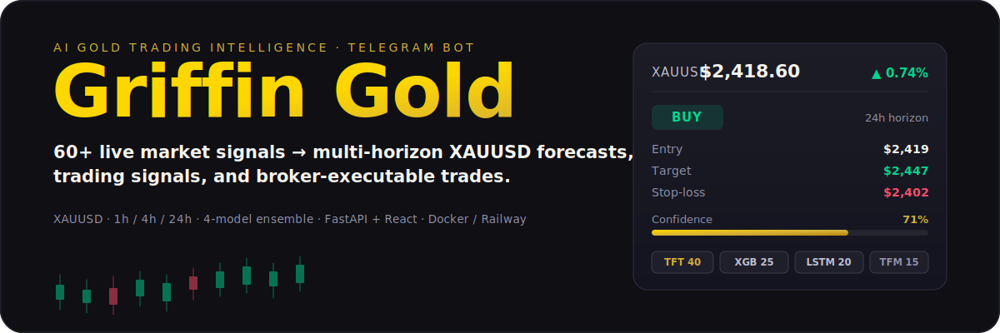
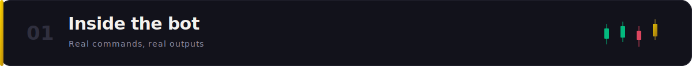
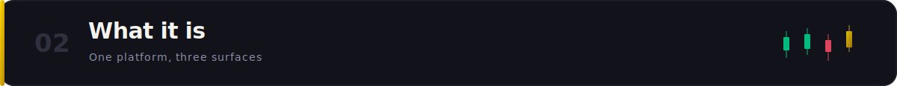
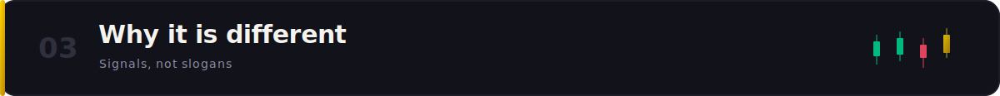
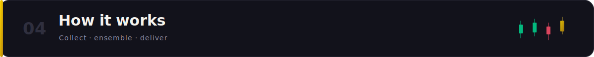
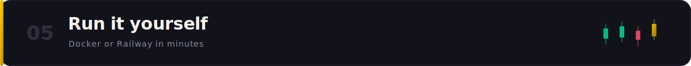
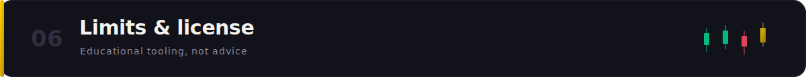

<p align="center">
  
</p>

<p align="center">
  
  
  
  
  
  
</p>

Griffin Gold is an AI trading-intelligence platform for **gold (XAUUSD)**. It collects 60+ live market signals every hour, runs them through a weighted four-model ensemble, and delivers multi-horizon predictions, trading signals, and an AI trade advisor — right inside a Telegram bot and its web mini-app. It can also route trades to a broker over MetaApi (MT4/MT5) and track its own accuracy in the open.

---

<p align="center">
  
</p>

Every prediction and signal is a Telegram command. A `/signal` looks like this:

```text
📈 Trading Signal (24H)

🟢 BUY

💰 Entry:      $2,419
🎯 Target:     $2,447
🛑 Stop-Loss:  $2,402

📊 Confidence: 71%
⚠️ Risk: ████████░░ (8/10)

💡 Real yields easing, ETF inflows turning positive,
   COT longs building into the London/NY overlap.
```

The full command surface:

| Command | What it does |
| --- | --- |
| `/predict` | Latest 1h / 4h / 24h price forecasts with confidence |
| `/signal` | Trading signal — entry, target, stop-loss, risk rating |
| `/advisor` | AI trade advisor: entry detection, sizing, trade management |
| `/news` | Real-time gold & macro news with sentiment scoring |
| `/cot` · `/macro` · `/sessions` | COT positioning, macro dashboard, market-session tracker |
| `/accuracy` | Self-tracked prediction record, broken down by timeframe |
| `/connect` · `/trade` · `/positions` · `/close` | Broker link and trade execution via MetaApi |
| `/alert` · `/game` · `/referral` · `/subscribe` | Price alerts, prediction game, referrals, Premium |

---

<p align="center">
  
</p>

One backend feeds three surfaces:

- **Telegram bot** (`aiogram`) — predictions, signals, advisor, alerts, and the prediction game in chat.
- **Web mini-app** (React + Vite + Tailwind) — dashboards, charts, and calculators rendered inside Telegram or the browser.
- **FastAPI backend** — 35+ API routers, a scheduler that collects data and generates predictions on a cron, and a public API with per-user keys.

State lives in PostgreSQL (SQLite for local dev) with Redis for caching, and the whole stack is white-label ready — swap branding, colors, and broker links per deployment without touching code.

---

<p align="center">
  
</p>

- **Gold-specific data, not generic price feeds.** 17 collectors pull the signals that actually move XAUUSD — real yields and CPI from FRED, COT positioning, ETF flows, central-bank gold buying, physical premium, and the gold/silver ratio.
- **An ensemble, not a single model.** Four models vote with fixed weights, then a sentiment layer amplifies or dampens the call and a quant-theory overlay adds structure. When models are untrained the ensemble automatically shifts weight to its strongest heuristic predictors.
- **Accuracy in the open.** Predictions are evaluated after their horizon closes; `/accuracy` reports the real hit rate per timeframe — wins and misses.
- **From forecast to fill.** The advisor sizes and manages trades, and the broker layer can execute them on MT4/MT5 through MetaApi, with a demo adapter for paper testing.

---

<p align="center">
  
</p>

<p align="center">
  
</p>

---

<p align="center">
  
</p>

**1. Configure.** Copy the example env and fill in what you have:

```bash
cp .env.example .env
```

Minimum to start the bot: `TELEGRAM_BOT_TOKEN`. Add `GOLDAPI_KEY` and `FRED_API_KEY` for live gold price and macro data; the rest (Alpha Vantage, Reddit, MetaApi) are optional and degrade gracefully.

**2. Run the whole stack** — backend, web mini-app, and Redis:

```bash
docker compose up --build
```

- Backend API + bot → `http://localhost:8000` (`/health`, `/docs`)
- Web mini-app → `http://localhost:3000`

**3. Or run the backend directly** for development:

```bash
cd backend
pip install -r requirements.txt
uvicorn app.main:app --reload --port 8000
```

Then open Telegram, `/start` your bot, and send `/predict`. New users get a 7-day Premium trial; the backend deploys to Railway from `railway.json` with a PostgreSQL plugin.

---

<p align="center">
  
</p>

- **Not financial advice.** Griffin Gold is for educational and informational purposes only. Trading gold and leveraged CFDs carries substantial risk; predictions and signals can be wrong, and past accuracy does not guarantee future results.
- **Data quality depends on your keys.** Without `GOLDAPI_KEY` / `FRED_API_KEY`, collectors fall back to secondary sources or skip signals, and untrained models run in heuristic mode. Train the ensemble (`backend/ml/`) before relying on model-driven output.
- **Broker execution is opt-in.** Live trading is disabled unless `BROKER_ENABLED=true` and a MetaApi token are set. Start with the demo adapter.
- **License.** No license file is currently included, so all rights are reserved by the repository owner. Open an issue if you'd like to use or extend it.
